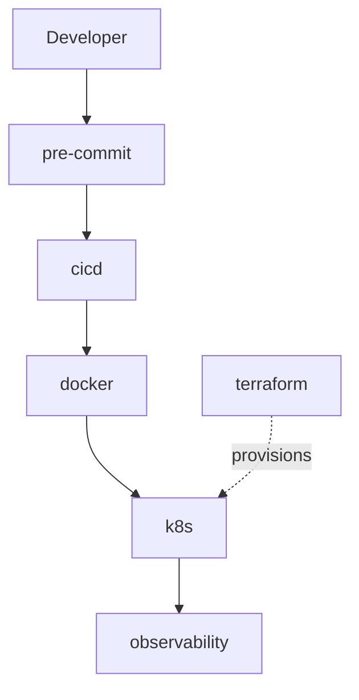

# nazjp

A collection of small, production-minded infrastructure and DevOps templates. Each project is self-contained, copy-paste friendly, and documented with the *why* behind the choices — not just the *what*.

Use them individually or combine them into a full delivery pipeline.

---

## Projects

| Project | What it solves |
|---------|----------------|
| [**cicd**](https://github.com/nazjp/cicd) | Split CI and deploy workflows with branch-based concurrency |
| [**docker**](docker/) | Multi-stage builds, non-root runtime, local dev with Compose |
| [**terraform**](terraform/) | Environment-scoped IaC with reusable modules |
| [**k8s**](k8s/) | Kustomize base + overlays for staging and production |
| [**pre-commit**](pre-commit/) | Fast local checks before code hits CI |
| [**observability**](observability/) | Prometheus + Grafana stack for metrics and dashboards |

---

## How they fit together

A typical flow:

1. **pre-commit** catches formatting and lint issues locally.
2. **cicd** runs tests on PR, deploys on merge to `main` / `stg`.
3. **docker** builds a slim, reproducible image.
4. **terraform** provisions cloud resources (cluster, networking, IAM).
5. **k8s** deploys the image with environment-specific overlays.
6. **observability** scrapes metrics and surfaces dashboards.

Each step is optional — adopt what you need.

---

## Philosophy

- **Minimal surface area** — only files you'd actually use, no boilerplate bloat.
- **Explain decisions** — every README includes design rationale, not just usage.
- **Portfolio-ready** — readable on GitHub, easy to fork and adapt.

---

## License

Each project is free to use. Attribution appreciated but not required.
