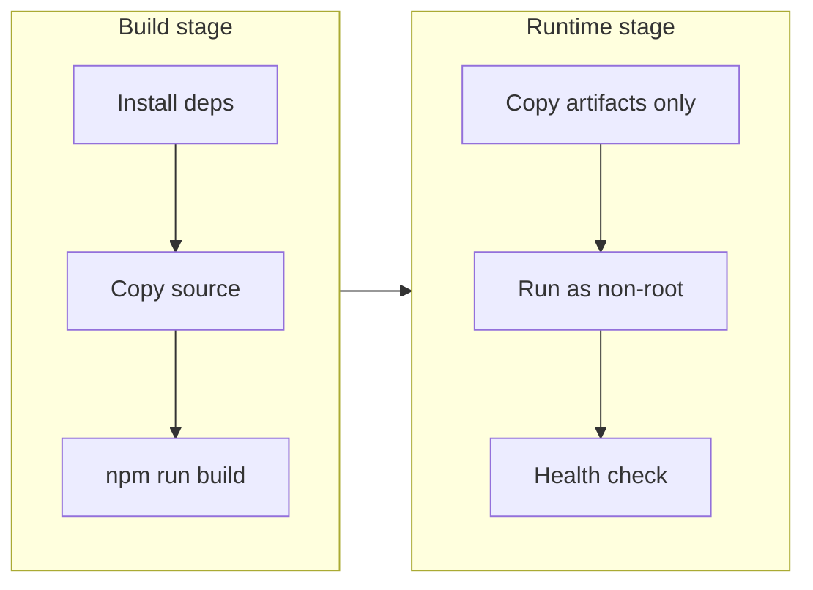

# Docker Build Template

A multi-stage Dockerfile and Compose setup for building slim production images and running the full stack locally. Non-root user, health checks, and layer caching baked in.

Swap the placeholder Node app for your own service — the patterns stay the same.

---

## How it works



| Layer | Purpose |
|-------|---------|
| `build` | Compiles app; dev dependencies stay here |
| `runtime` | Only production artifacts + prod deps |
| `docker-compose` | Local app + Postgres with health-gated startup |

---

## Quick start

```bash
# Build and run locally
docker compose up --build

# Hit the app
curl http://localhost:3000
curl http://localhost:3000/health
```

---

## Files

| File | Role |
|------|------|
| [`Dockerfile`](Dockerfile) | Multi-stage build → slim runtime image |
| [`docker-compose.yml`](docker-compose.yml) | App + Postgres for local development |
| [`.dockerignore`](.dockerignore) | Keeps build context small and fast |
| [`src/index.js`](src/index.js) | Minimal HTTP server (replace with your app) |

---

## Design choices

**Why multi-stage?**

Build tools and dev dependencies never ship to production. Final images are smaller, faster to pull, and have a smaller attack surface.

**Why non-root?**

Containers should not run as root. A dedicated `app` user limits blast radius if the process is compromised.

**Why `HEALTHCHECK`?**

Orchestrators (Docker Compose, Kubernetes, ECS) can wait for the app to be ready and restart unhealthy containers automatically.

**Why `depends_on` with `condition: service_healthy`?**

The app won't start until Postgres accepts connections — avoids crash-looping on a cold database start.

**Why Alpine?**

Small base image. For glibc-specific binaries, switch to `node:22-bookworm-slim` instead.

---

## Adapting the template

**Pin dependencies for production** — add a `package-lock.json` and replace `npm install` with `npm ci` in the Dockerfile for reproducible builds.

**Add secrets** — use Compose env files (`.env`, gitignored) or Docker secrets in Swarm/Kubernetes:

```yaml
env_file: .env
```

**Push to a registry** — pair with the [cicd](../cicd/) template:

```yaml
- name: Build and push
  run: |
    docker build -t ghcr.io/${{ github.repository }}:${{ github.sha }} .
    docker push ghcr.io/${{ github.repository }}:${{ github.sha }}
```

**Deploy to Kubernetes** — use the image tag from CI in the [k8s](../k8s/) overlays.

---

## File structure

```
.
├── Dockerfile
├── docker-compose.yml
├── .dockerignore
├── package.json
└── src/
    └── index.js
```

---

## License

Use freely in your own projects. Attribution appreciated but not required.
