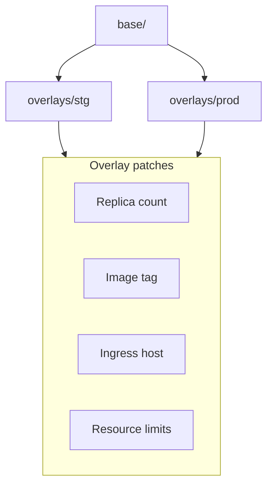

# Kubernetes Deployment Template

Kustomize-based manifests with a shared **base** and environment **overlays** for staging and production. Includes security defaults, health probes, and resource limits.

Designed to pair with the [docker](../docker/) image and [cicd](../cicd/) deploy workflow.

---

## How it works



| Overlay | Replicas | Image tag | Host |
|---------|----------|-----------|------|
| `stg` | 1 | `stg` | `stg.app.example.com` |
| `prod` | 3 | `latest` | `app.example.com` |

---

## Quick start

```bash
# Preview staging manifests
kubectl kustomize overlays/stg

# Apply to cluster
kubectl apply -k overlays/stg

# Production
kubectl apply -k overlays/prod
```

Requires `kubectl` and a cluster with the NGINX Ingress Controller.

---

## File structure

```
.
├── base/
│   ├── kustomization.yaml
│   ├── namespace.yaml
│   ├── deployment.yaml
│   ├── service.yaml
│   └── ingress.yaml
└── overlays/
    ├── stg/
    │   └── kustomization.yaml
    └── prod/
        └── kustomization.yaml
```

---

## Design choices

**Why Kustomize over Helm?**

No templating language to learn — plain YAML with patches. Built into `kubectl`. Great for small-to-medium apps where chart complexity isn't justified.

**Why base + overlays?**

DRY manifests with environment-specific differences isolated in overlay dirs. Adding `dev` is copying `stg` and tweaking values.

**Why security context defaults?**

`runAsNonRoot`, dropped capabilities, and `readOnlyRootFilesystem` are baseline hardening. Pair with the non-root user from the [docker](../docker/) template.

**Why readiness + liveness probes?**

Kubernetes only routes traffic after `/health` succeeds. Unhealthy pods get restarted without taking down the service.

**Why `namePrefix` per overlay?**

`stg-app` and `prod-app` can coexist in the same cluster during migrations or blue/green cutovers.

---

## CI integration

From the [cicd](../cicd/) deploy workflow:

```yaml
- name: Deploy
  run: |
    OVERLAY=${{ inputs.branch == 'main' && 'prod' || 'stg' }}
    kubectl set image deployment/${OVERLAY}-app \
      app=ghcr.io/${{ github.repository }}:${{ inputs.ref }} \
      -n app
    kubectl rollout status deployment/${OVERLAY}-app -n app
```

Or apply the full overlay after updating the image tag in `kustomization.yaml`.

---

## Adapting the template

**Add secrets** — create `base/secret.yaml` (or use External Secrets Operator) and reference via `envFrom`:

```yaml
envFrom:
  - secretRef:
      name: app-secrets
```

**Add HPA** — patch in the prod overlay:

```yaml
resources:
  - hpa.yaml
```

**Switch ingress** — change `ingressClassName` and annotations for your controller (ALB, Traefik, etc.).

---

## License

Use freely in your own projects. Attribution appreciated but not required.
