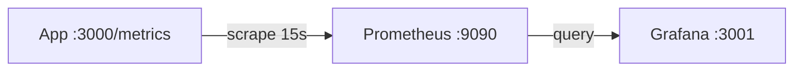

# Observability Stack Template

A local Prometheus + Grafana stack for metrics collection and dashboards. Provisioning is file-based — datasources and dashboards load automatically on startup.

Run it standalone or wire it to the [docker](../docker/) app for end-to-end metrics.

---

## How it works



| Component | URL | Default credentials |
|-----------|-----|---------------------|
| Prometheus | http://localhost:9090 | — |
| Grafana | http://localhost:3001 | `admin` / `admin` |

---

## Quick start

```bash
docker compose up -d

# Open Grafana → Dashboards → "App Overview"
open http://localhost:3001
```

To scrape the [docker](../docker/) app, uncomment the `app` service in `docker-compose.yml` and add a `/metrics` endpoint to your application (or use a Prometheus client library).

---

## File structure

```
.
├── docker-compose.yml
├── prometheus/
│   └── prometheus.yml
└── grafana/
    ├── dashboards/
    │   └── app-overview.json
    └── provisioning/
        ├── dashboards/
        │   └── dashboards.yml
        └── datasources/
            └── datasources.yml
```

---

## Design choices

**Why Prometheus + Grafana?**

Industry-standard metrics stack. Prometheus pulls metrics on an interval; Grafana visualizes and alerts. Both have huge ecosystem support.

**Why file-based provisioning?**

Dashboards and datasources are version-controlled YAML/JSON — no manual UI setup, reproducible across machines and environments.

**Why separate from the app compose file?**

Observability is often a shared platform concern. Keeping it in its own compose file lets you run it once and scrape multiple services.

**Why `up` and `scrape_duration_seconds` in the starter dashboard?**

Minimal but useful — confirms targets are reachable and scraping isn't slow. Replace with app-specific metrics (`http_requests_total`, etc.) as you instrument.

---

## Production path

For Kubernetes, consider:

- [Prometheus Operator](https://prometheus-operator.dev/) with `ServiceMonitor` CRDs
- Managed Grafana (AWS, GCP, Grafana Cloud)
- Alertmanager for paging on `up == 0`

Pair with the [k8s](../k8s/) template by adding Pod annotations:

```yaml
annotations:
  prometheus.io/scrape: "true"
  prometheus.io/port: "3000"
  prometheus.io/path: "/metrics"
```

---

## Adapting the template

**Add Alertmanager** — extend `docker-compose.yml` and configure `alerting` in `prometheus.yml`.

**Add Loki for logs** — add a Loki + Promtail service; Grafana can query both metrics and logs in one place.

**Retention** — tune Prometheus storage:

```yaml
command:
  - --storage.tsdb.retention.time=7d
```

---

## License

Use freely in your own projects. Attribution appreciated but not required.
