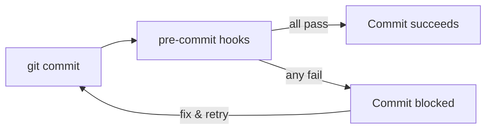

# Pre-commit Hooks Template

Fast, local quality gates that run before code reaches CI. Catches formatting issues, invalid YAML, leaked secrets, Dockerfile problems, and Terraform drift — in seconds.

Hooks are scoped to common DevOps file types across the other [nazjp](../) templates.

---

## How it works



| Hook | Catches |
|------|---------|
| `trailing-whitespace` | Stray spaces, messy diffs |
| `check-yaml` / `yamllint` | Broken workflow and K8s manifests |
| `detect-private-key` | Accidental key commits |
| `hadolint` | Dockerfile anti-patterns |
| `terraform_fmt` / `terraform_validate` | Unformatted or invalid HCL |

---

## Quick start

```bash
# Install pre-commit (macOS)
brew install pre-commit

# Activate hooks in your repo
pre-commit install

# Run against all files once
pre-commit run --all-files
```

After setup, hooks run automatically on every `git commit`.

---

## File structure

```
.
└── .pre-commit-config.yaml
```

Copy this file to the root of any repository (or the [nazjp](../) monorepo root).

---

## Design choices

**Why pre-commit over CI-only checks?**

Feedback in seconds, not minutes. Developers fix issues before pushing — fewer noisy CI failures and less context switching.

**Why these specific hooks?**

They map directly to the other templates: YAML for [cicd](../cicd/) and [k8s](../k8s/), Hadolint for [docker](../docker/), Terraform hooks for [terraform](../terraform/).

**Why `hadolint-docker`?**

No local Hadolint install needed — runs in a container via the pre-commit wrapper.

**Why relaxed yamllint?**

GitHub Actions and Kustomize YAML can be long. `line-length: 120` avoids fighting the linter on every workflow file.

---

## Adapting the template

**Add language-specific hooks** — e.g. for a Node app:

```yaml
- repo: https://github.com/pre-commit/mirrors-eslint
  rev: v9.0.0
  hooks:
    - id: eslint
```

**Run in CI as a safety net** — add to [cicd](../cicd/):

```yaml
- name: Pre-commit
  run: |
    pip install pre-commit
    pre-commit run --all-files
```

**Skip hooks temporarily** — `git commit --no-verify` (use sparingly).

---

## License

Use freely in your own projects. Attribution appreciated but not required.
