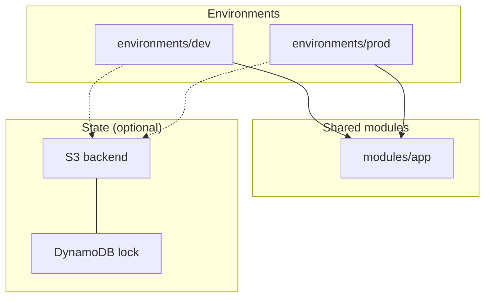

# Terraform IaC Template

Environment-scoped infrastructure with reusable modules. One directory per environment (`dev`, `prod`), shared modules, and sensible defaults for tagging, encryption, and state.

The included example provisions an S3 bucket — replace the module with your own resources (VPC, EKS, RDS, etc.).

---

## How it works



| Layer | Responsibility |
|-------|----------------|
| `environments/*` | Provider config, backend, env-specific values |
| `modules/*` | Reusable resource definitions |
| `terraform.tfvars` | Per-environment variable values |

---

## Quick start

```bash
cd environments/dev

terraform init
terraform plan
terraform apply
```

Requires AWS credentials configured (`aws configure` or environment variables).

---

## File structure

```
.
├── environments/
│   ├── dev/
│   │   ├── main.tf
│   │   ├── variables.tf
│   │   ├── outputs.tf
│   │   └── terraform.tfvars
│   └── prod/
│       └── ...
└── modules/
    └── app/
        ├── main.tf
        ├── variables.tf
        └── outputs.tf
```

---

## Design choices

**Why separate environment directories?**

Each environment has its own state file, variables, and lifecycle. `dev` changes don't risk `prod`. Teams can apply different approval gates per directory in CI.

**Why modules?**

DRY resource definitions. Environment dirs stay thin — they wire providers, backends, and pass variables. The module owns the resources.

**Why `default_tags` on the provider?**

Every resource gets `Project`, `Environment`, and `ManagedBy` tags automatically. Cost allocation and cleanup become tractable.

**Why versioning only in prod?**

Dev buckets churn fast; versioning adds cost with little benefit. Prod gets versioning enabled via a conditional in the module.

**Why remote state (commented out)?**

Local state is fine for solo experiments. Teams should use S3 + DynamoDB locking — uncomment the `backend` block and create the bucket/table once.

---

## CI integration

Pair with the [cicd](../cicd/) template. Example deploy step:

```yaml
- name: Terraform plan
  working-directory: environments/${{ inputs.branch == 'main' && 'prod' || 'dev' }}
  run: |
    terraform init -input=false
    terraform plan -input=false -out=tfplan

- name: Terraform apply
  if: github.ref == 'refs/heads/main'
  run: terraform apply -input=false -auto-approve tfplan
```

Use GitHub Environments with required reviewers for `prod` applies.

---

## Adapting the template

**Add staging** — copy `environments/dev` to `environments/stg`, adjust `terraform.tfvars`.

**Add a VPC module** — create `modules/vpc/`, reference it from environment `main.tf`:

```hcl
module "vpc" {
  source      = "../../modules/vpc"
  project     = var.project
  environment = var.environment
  cidr_block  = "10.0.0.0/16"
}
```

**Switch cloud provider** — replace the `aws` provider block; keep the environments/modules layout.

---

## License

Use freely in your own projects. Attribution appreciated but not required.
